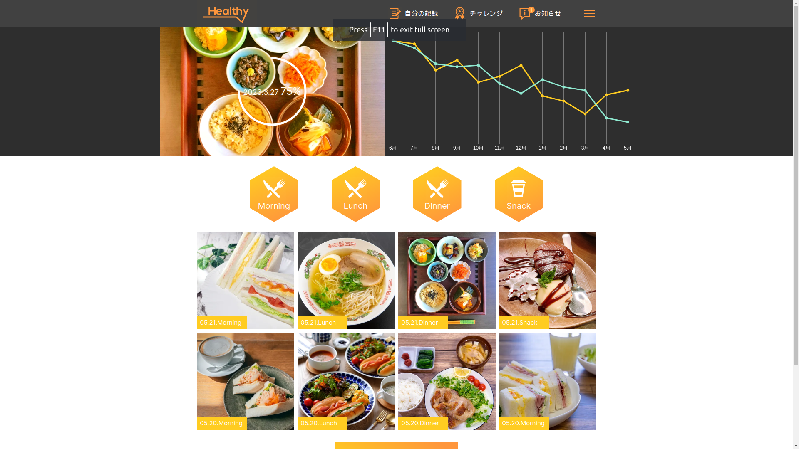

# Healthy App - Interview Test Project
[https://react-test-healthy.vercel.app/](https://react-test-healthy.vercel.app/)


## How to use
- Clone project:
```shell
$ git clone https://github.com/sonvt-fe/react-test-healthy.git
$ cd react-test-healthy
```
- Connect to the API by modifying the files in the [lib](./src/lib/) directory to fetch data
```shell
# install packages
$ npm install
# starts the application in development mode
$ npm run dev
# creates an optimized production build
$ npm run build
# starts the application in production mode
$ npm run start
```

## Stack
- [Next.js](https://nextjs.org/) - A React framework with hybrid static & server rendering, and route pre-fetching, etc.
- [Chart.js](https://react-chartjs-2.js.org/) - Simple yet flexible JavaScript charting library for the modern web.
- [Tailwind css](https://tailwindcss.com/) - An open source CSS framework.
- [Typescript](https://www.typescriptlang.org/) TypeScript is a free and open source high-level programming language

## Project structure
```
$PROJECT_ROOT
│   # Static files for images
├── public
│   # src
└── src
    │   # Page files
    ├── app
    │   # React component files
    ├── components
    │   # list hardcode data
    ├── constant
    │   # custom hooks
    ├── hooks
    │   # define interfaces
    ├── interfaces
    │   #Non-react modules
    ├── lib
    │   # fake data
    ├── mock
    │   #  storing all utility functions
    └── utils
```

